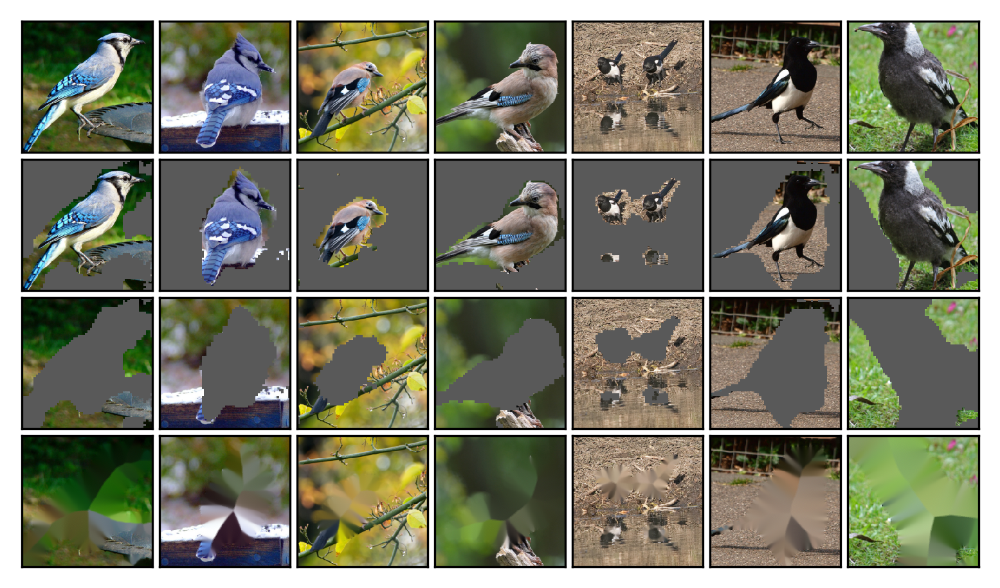

# Classifier-agnostic saliency map extraction

## Example of using classifier-agnostic saliency map extraction on ImageNet

This repository contains the code originally forked from the [ImageNet training in PyTorch](https://github.com/pytorch/examples/tree/master/imagenet) that is modified to present the performance of [classifier-agnostic saliency map extraction](https://arxiv.org/abs/1805.08249), a practical algorithm to train a classifier-agnostic saliency mapping by simultaneously training a classifier and a saliency mapping. The method was proposed by Konrad Żołna, Krzysztof J. Geras and Kyunghyun Cho.

The authors would like to acknowledge the code review done by Jason Phang ([zphang](https://github.com/zphang)).

## Software requirements

+ `Python 3.6` and `PyTorch 0.4` for training procedure (`train.py`).
+ The `bs4` library to run `score.py` that computes localization metrics described in the paper.
+ The `opencv-python` library to inpaint images which is needed to run `eval.py` and `plot.py`.

## Setup

ImageNet dataset should be stored in `IMAGENET-PATH` path and set up in the usual way (separate `train` and `val` folders with 1000 subfolders each). See [this repo](https://github.com/facebook/fb.resnet.torch/blob/master/INSTALL.md#download-the-imagenet-dataset) for detailed instructions how to download and set up the dataset.

ImageNet annotations should be in `IMAGENET-ANN` directory that contains 50000 files named `ILSVRC2012_val_<id>.xml` where `<id>` is the validation image id (for example `ILSVRC2012_val_00050000.xml`). It may be simply obtained by unzipping [the official validation bounding box annotations archive](http://www.image-net.org/challenges/LSVRC/2012/nnoupb/ILSVRC2012_bbox_val_v3.tgz) to `IMAGENET-ANN` directory.

A directory `CASMS-PATH` is used to store all trained models.

## How to run the code

### Training

The easiest way to train classifier-agnostic saliency mapping (CASM) is to run

+ `python3 train.py IMAGENET-PATH --casms-path CASMS-PATH --log-path LOG-PATH --reproduce L`

where `LOG-PATH` is a directory for the log to be saved at. The `--reproduce` option sets all hyperparameters linked with a given thinning strategy to reproduce results from [the paper](https://arxiv.org/abs/1805.08249) (possible options `F|L|FL|L100|L1000`, see the paper for details).

For the comparison, one can try `--reproduce F` which results in training classifier-dependent saliency mapping (called Baseline in the paper).

### Object localization (and basic statistics)

Once the saliency mappings are trained and stored in `CASMS-PATH` one can run 

+ `python3 score.py IMAGENET-PATH --annotation-path IMAGENET-ANN --casms-path CASMS-PATH`
or
+ `python3 score.py IMAGENET-PATH --annotation-path IMAGENET-ANN --casms-path CASMS-PATH --log-path LOG-PATH --save-to-file`

where `LOG-PATH` is again the directory for logs to be saved at (note that the directory may be a different than the one used to store training logs since the training logs are not used in the evaluation).

For each CASM in `CASMS-PATH` the basic statistics and localization metrics are computed and (if `--log-path LOG-PATH --save-to-file` is used) saved as a separate file in `LOG-PATH`.

#### Score your own architecture

The script `score.py` uses two functions `load_model` and `get_masks_and_check_predictions` from `model_basics.py`. It should be simple to reimplement them to score a new architecture. Since converting a Torch Tensor to a NumPy array and vice versa is a breeze, the `get_masks_and_check_predictions` is implemented in the way that inputs and outputs are NumPy arrays to make the adjustment procedure to a new model even simpler.

The function `get_masks_and_check_predictions` takes as an input a batch of images, corresponding ground truth targets and the dictionary describing the model (that is, an output of the function `load_model` which takes the path to the model as an argument). By default, the images are normalized which can be deactivated with `--not-normalize` flag if one prefers to use its own normalization. The output of `get_masks_and_check_predictions` are three NumPy arrays.
+ Batch of continuous masks (size: `BATCH_SIZEx224x224`). This array contains masks predicted for the entire `224x224` pixel images (values between zero and one).
+ Batch of rectangular predictions (size: `BATCH_SIZEx224x224`) corresponding to object localizations, that are necessary to compute the scores. Each rectangle is obtained from continuous mask and is represented by a block of ones on the background of zeros.
+ NumPy array consisting of `BATCH_SIZE` binary values. The value in the array corresponding to a given images is one if the classifier makes a correct prediction for this image or zero otherwise. This array is necessary to compute the OM metric (see [the paper](https://arxiv.org/abs/1805.08249) for details).

### Classification by multiple classifiers

Similarly to `score.py` one can run

+ `python3 eval.py IMAGENET-PATH --casms-path CASMS-PATH`
or
+ `python3 eval.py IMAGENET-PATH --casms-path CASMS-PATH --log-path LOG-PATH --save-to-file`

to get classification accuracy for modified images (masked-in, masked-out and inpainted masked-out images, see [the paper](https://arxiv.org/abs/1805.08249) for definitions).

The option `--resnets-path RESNETS-PATH` can be used to load pre-trained classifiers from the `RESNETS-PATH` that will be also evaluated. It is assumed that these classifiers are all ResNet-50 and are saved in the format like in [this official repository](https://github.com/pytorch/examples/tree/master/imagenet).

### Visualization

To plot visualizations one can run

+ `python3 plot.py IMAGENET-PATH --casm-path SINGLE-CASM-PATH --plots-path PLOTS-PATH`

where `SINGLE-CASM-PATH` is a path to a single CASM (not a directory) and `PLOTS-PATH` is a directory where visualizations for a given CASM will be saved.

The exemplary visualization is below (see the caption of Figure 2 from [the paper](https://arxiv.org/abs/1805.08249) for the description).

### Additional options

There are a few hyper-parameters of the training procedure. Running

+ `python3 train.py --help`

displays the full list of them. The same works for `score.py`, `eval.py` and `plot.py`.

## Reference

If you found this code useful, please cite [the following paper](https://arxiv.org/abs/1805.08249):

Konrad Żołna, Krzysztof J. Geras, Kyunghyun Cho. **"Classifier-agnostic saliency map extraction."** *arXiv preprint arXiv:1805.08249 (2018).*

    @inproceedings{zolna2019classifier,
      title={Classifier-agnostic saliency map extraction},
      author={Zolna, Konrad and Geras, Krzysztof J and Cho, Kyunghyun},
      booktitle={Proceedings of the AAAI Conference on Artificial Intelligence},
      volume={33},
      pages={10087--10088},
      year={2019}
    }
